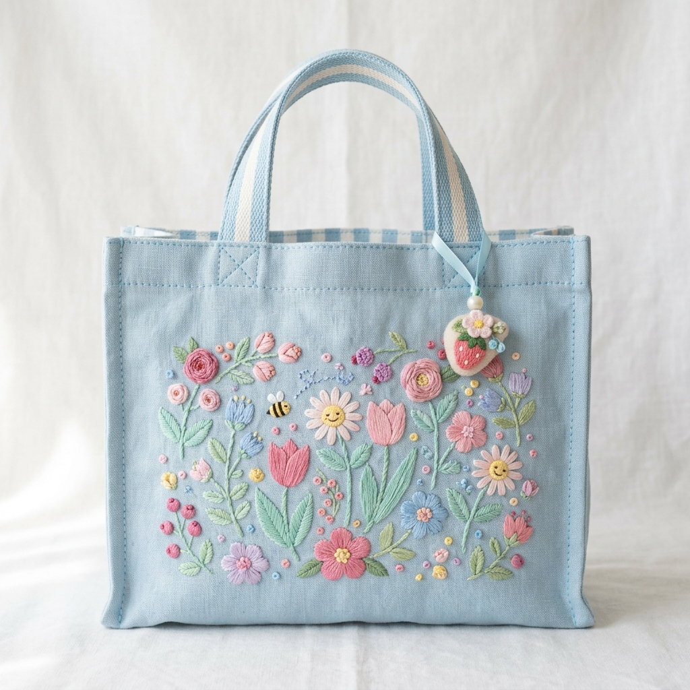
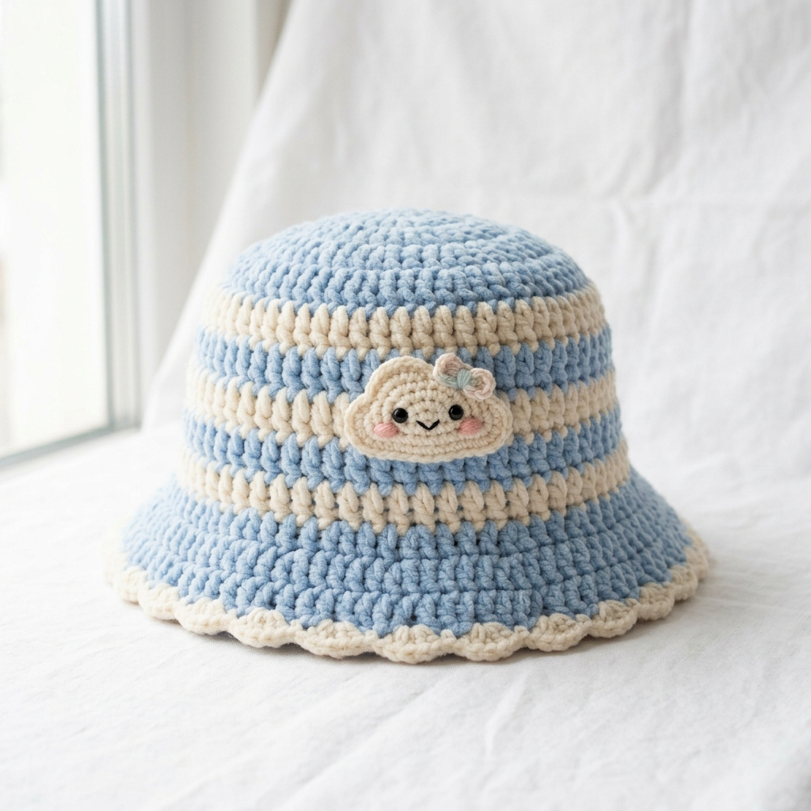
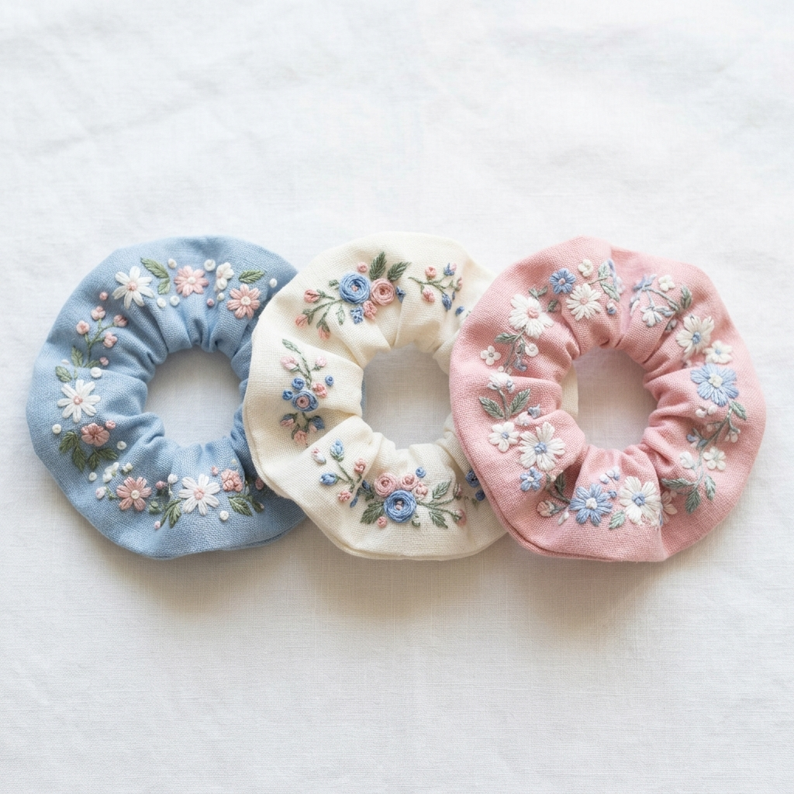
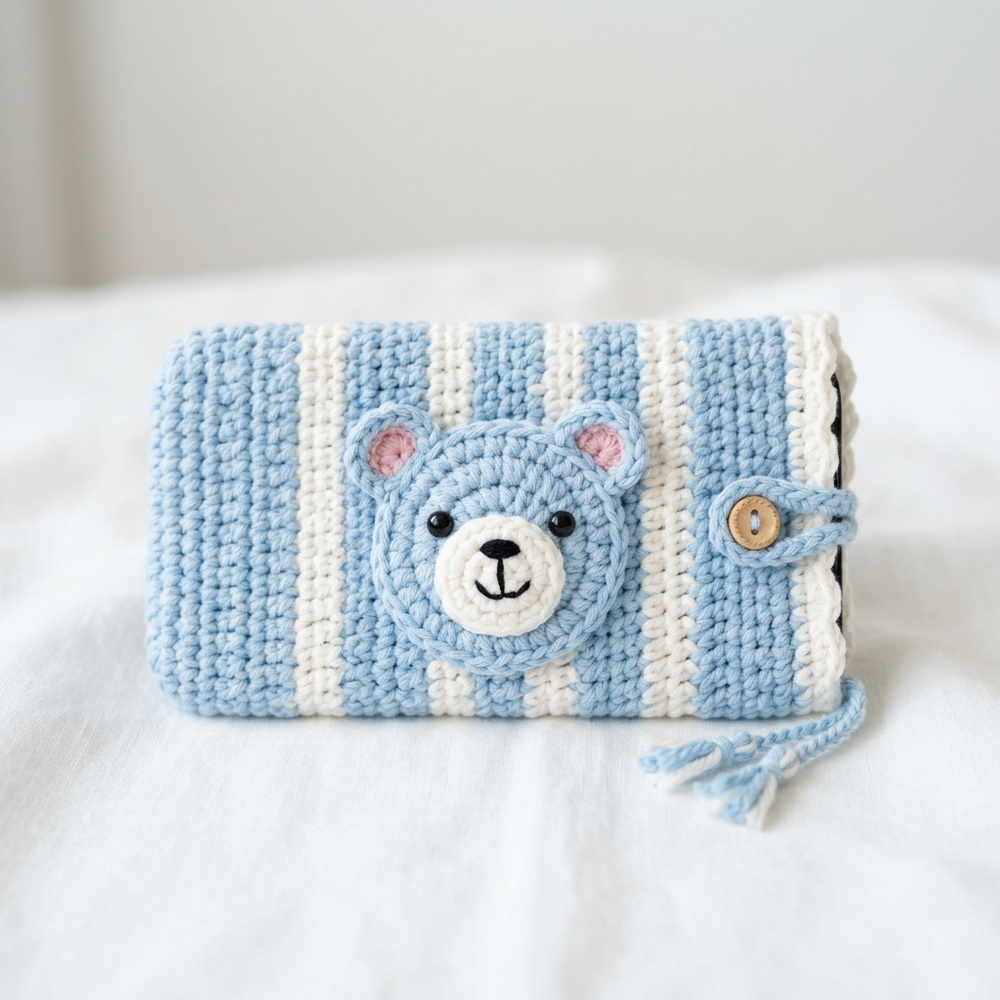
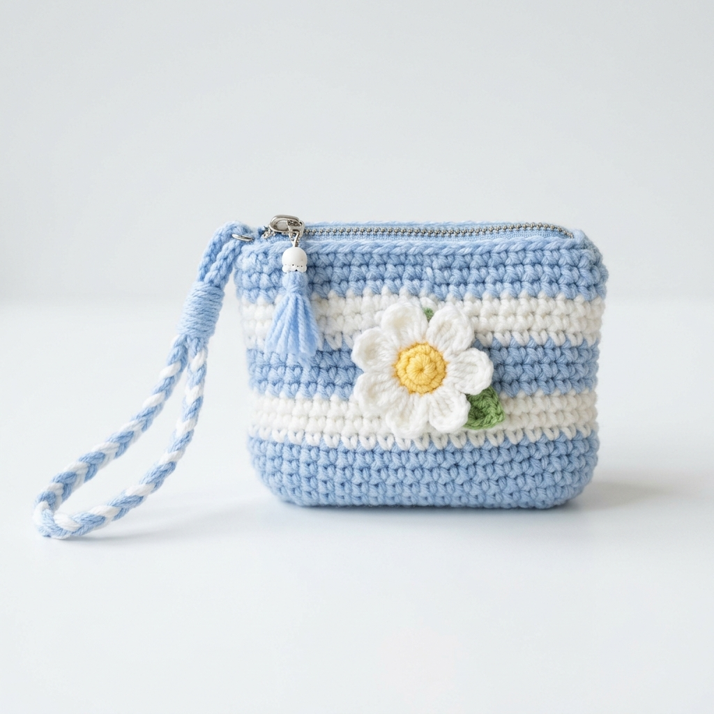

# 🧶 JariJemari — Handmade with Love

> Toko online handmade products lucu & estetik. Rajutan, bordiran, clay art, dan aksesoris unik buatan tangan dengan cinta 💕


---

## ✨ Tentang

**JariJemari** adalah website toko handmade yang menjual produk-produk lucu dan estetik seperti rajutan, bordiran, clay art, dan aksesoris unik. Setiap produk dibuat seluruhnya dengan tangan, penuh detail dan kasih sayang.

Tema desain: **Biru pastel & putih kawaii** 🩵

## 📸 Preview Produk

| Bunny Keychain | Tote Bag Bordir | Bucket Hat Rajut | Buket Bunga Rajut |
|:-:|:-:|:-:|:-:|
|  |  |  |  |

| Scrunchie Set | Phone Case Bear | Clay Photo Frame | Coin Purse Daisy |
|:-:|:-:|:-:|:-:|
|  |  |  |  |

## 🎯 Fitur Utama

- 🏠 **Landing Page** — Hero section dengan floating product preview & animasi blob
- 🏷️ **Kategori Produk** — 5 kategori: Rajutan, Bordir, Clay & Frame, Buket & Gift, Aksesoris
- 🔍 **Search & Sort** — Pencarian real-time + sorting (terbaru, harga, nama)
- 🛒 **Shopping Cart** — Sidebar cart dengan localStorage persistence
- 📱 **Product Detail Modal** — Detail produk, quantity picker, link WhatsApp
- 💬 **WhatsApp Checkout** — Checkout langsung via WhatsApp
- ❤️ **Wishlist** — Toggle wishlist untuk produk favorit
- ⭐ **Testimonials** — Slider review dari pelanggan
- 🔔 **Toast Notifications** — Notifikasi popup animasi
- 📊 **Stats Counter** — Animated counter untuk statistik toko
- 📱 **Responsive** — Desktop, tablet, & mobile ready

## 🗂️ Struktur Project

```
toko_jarijemari/
├── app.py                          # Flask backend + API + Database
├── jarijemari.db                   # SQLite database (auto-generated)
├── README.md
├── templates/
│   └── index.html                  # Landing page template
└── static/
    ├── css/
    │   └── style.css               # Stylesheet (tema biru-putih kawaii)
    ├── js/
    │   └── main.js                 # JavaScript (cart, API, modal, animasi)
    └── images/
        ├── product_bunny_keychain.png
        ├── product_tote_bag.png
        ├── product_bucket_hat.png
        ├── product_flower_bouquet.png
        ├── product_scrunchie.png
        ├── product_phone_case.png
        ├── product_photo_frame.png
        └── product_coin_purse.png
```

## 🔌 API Endpoints

| Method | Endpoint | Deskripsi |
|--------|----------|-----------|
| `GET` | `/api/products` | List semua produk (query: `category`, `search`, `sort`, `featured`) |
| `GET` | `/api/products/<slug>` | Detail satu produk berdasarkan slug |
| `GET` | `/api/categories` | List semua kategori + jumlah produk |
| `GET` | `/api/testimonials` | List review pelanggan |
| `GET` | `/api/stats` | Statistik toko (produk, pelanggan, dll) |
| `POST` | `/api/orders` | Buat pesanan baru |
| `POST` | `/api/reviews` | Tambah review produk |

### Contoh Request

```bash
# Get semua produk
curl http://localhost:5008/api/products

# Filter by kategori
curl http://localhost:5008/api/products?category=rajutan

# Search produk
curl http://localhost:5008/api/products?search=bunny

# Sort by harga terendah
curl http://localhost:5008/api/products?sort=price_low

# Get detail produk
curl http://localhost:5008/api/products/bunny-keychain

# Buat pesanan baru
curl -X POST http://localhost:5008/api/orders \
  -H "Content-Type: application/json" \
  -d '{
    "customer_name": "Dinda",
    "customer_phone": "081234567890",
    "customer_address": "Jakarta",
    "items": [
      {"product_id": 1, "quantity": 2},
      {"product_id": 3, "quantity": 1}
    ]
  }'
```

## 🗄️ Database Schema

Database menggunakan **SQLite** dan di-generate otomatis saat pertama kali menjalankan `app.py`.

```
categories      — Kategori produk (Rajutan, Bordir, Clay, dll)
products        — Data produk (nama, harga, deskripsi, gambar, badge, stok)
reviews         — Review pelanggan per produk
orders          — Data pesanan pelanggan
order_items     — Item dalam setiap pesanan
testimonials    — Testimoni pelanggan untuk landing page
```

## 🚀 Cara Menjalankan

### Prerequisites

- Python 3.9+
- pip

### Setup

```bash
# 1. Clone repository
git clone git@github.com:RazorBold/toko_jarijemari.git
cd toko_jarijemari

# 2. Install dependencies
pip install flask

# 3. Jalankan server
python3 app.py
```

Server akan berjalan di **http://localhost:5008** 🎉

> **Note:** Database akan otomatis dibuat dan di-seed dengan data produk saat pertama kali dijalankan.

## 🎨 Tech Stack

| Layer | Teknologi |
|-------|-----------|
| **Backend** | Python, Flask |
| **Database** | SQLite |
| **Frontend** | HTML5, CSS3, Vanilla JavaScript |
| **Font** | Google Fonts (Quicksand, Fredoka One) |
| **Design** | Kawaii blue & white theme |

## 📝 Catatan

- Nomor WhatsApp untuk checkout bisa diubah di `templates/index.html` dan `static/js/main.js`
- Produk dan data awal bisa diubah di fungsi `init_db()` pada `app.py`
- Hapus file `jarijemari.db` lalu jalankan ulang `app.py` untuk reset database

---

<p align="center">
  Dibuat dengan 🧶 dan ❤️ oleh <strong>JariJemari</strong>
</p>
